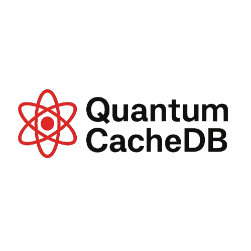

# QuantumCacheDB



This package provides **QuantumCacheDB**, a fast, secure, and reactive offline database system built for Dart and Flutter applications. It supports hybrid data models, encryption, real-time updates, and offline-first caching.

## Features

- **Hybrid Data Model**: Supports both key-value and document storage.
- **Reactive Updates**: Uses Streams for real-time updates.
- **Speed Optimized**: In-memory caching and persistent storage for lightning-fast performance.
- **Secure**: AES-256 encryption at rest and app-specific security measures.
- **Offline-First**: Works offline, with optional cloud sync support.
- **Schema-less**: No need to define schemas, making it developer-friendly.

## Getting started

To get started with **QuantumCacheDB**, ensure you have Dart or Flutter installed on your system. You can follow the official [installation guides for Dart](https://dart.dev/get-dart) or [Flutter](https://flutter.dev/docs/get-started/install).

1. Add the package to your `pubspec.yaml`:

   ```yaml
   dependencies:
     quantumcachedb: ^1.0.0
   ```

2. Run `flutter pub get` (or `dart pub get` for Dart projects) to install the dependencies.

## Usage

Here is a quick example of how to use **QuantumCacheDB** in your Dart or Flutter application:

```dart
import 'package:quantumcachedb/quantumcachedb.dart';

// Initialize database
var db = QuantumCacheDB();

// Adding data
db.set('user123', {'name': 'John Doe', 'email': 'john.doe@example.com'});

// Getting data
var user = db.get('user123');
print(user); // Output: {name: John Doe, email: john.doe@example.com}
```

## Additional information

For more information on how to use **QuantumCacheDB**, check out the [documentation](https://quantumcachedb.com/docs).

If you encounter any issues, feel free to file them in the [issues section](https://github.com/QuantumCacheDB/quantum-cache-db/issues). We welcome contributions! If you'd like to contribute, check out our [contributing guidelines](https://github.com/QuantumCacheDB/quantum-cache-db/blob/main/CONTRIBUTING.md).

### License

This project is licensed under the MIT License - see the [LICENSE](LICENSE) file for details.
